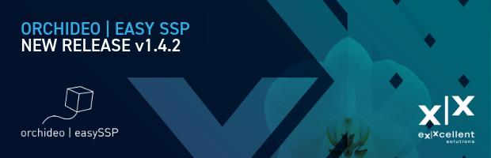
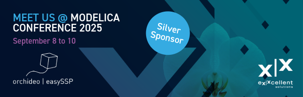

#### orchideo \| easySSP v1.4.2 released

The new **easySSP version 1.4.2** introduces **hierarchical parameter handling** for component synchronization, making it easier to display and override parameters defined at higher system levels. Additionally, a new merge function for parameter bindings allows for more efficient consolidation of parameter configurations.

Building on existing functionality, **subsystems and components** can now be exported and imported as **System Structure Description (SSD)** files. Components can reference SSDs for improved reuse, and a new **convert feature** enables seamless switching between systems and components — while preserving connectors, parameters, and metadata.

**Workflow capabilities** have also been extended: **dynamic workflow parts** and **workflow variables** now enable a more flexible, user-specific process guidance and documentation. Moreover, multiple workflows can be bundled within a single SSP container and selected via the navigation bar.

To further support metadata exchange and model reuse, easySSP now offers flexible **import and export of classifications** in the **Simulation Resource Metadata (SRMD)** format, covering all metadata scopes within the app.

**easySSP** is based entirely on open standards like **SSP**, **FMI**, and **SSP Traceability**. Learn more at [easy-ssp.com](https://easy-ssp.com).

#### Meet us at the 16th International Modelica & FMI Conference

We’re excited to participate in the **16th International Modelica and FMI Conference** as a Silver Sponsor — and to showcase **easySSP** in action!

Join us for the **tutorial** *“Introduction to the System Structure and Parameterization (SSP) Standard”*, presented together with **Dag Bruck (Dassault Systèmes)** and **Antoine Vandamme (Robert Bosch GmbH)**.

Don’t miss our **vendor presentation** *“Building Trust in Simulation-Based Engineering: Credible Simulations with easySSP and the SSP Standard”*, where we’ll explore how easySSP supports traceable and trustworthy system simulation.

Stop by our **booth** to experience easySSP live and connect with our team — we look forward to seeing you in **Lucerne**!

