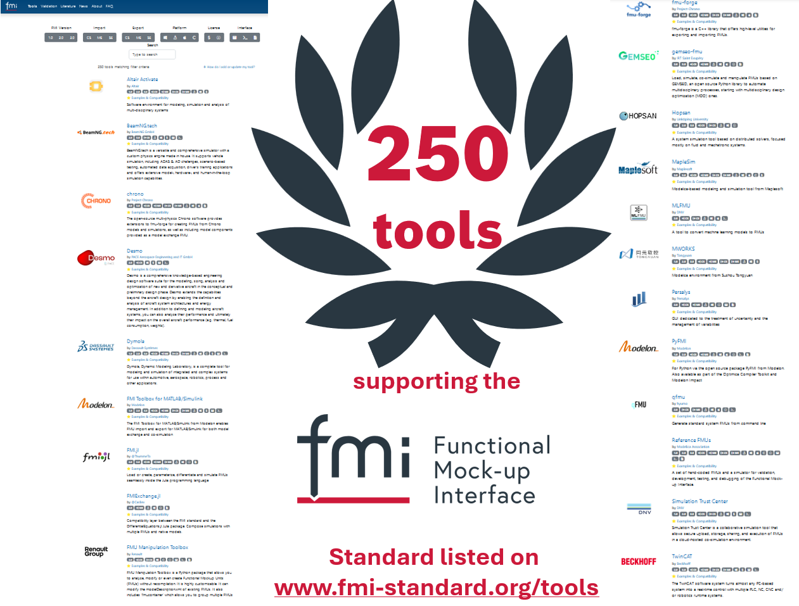
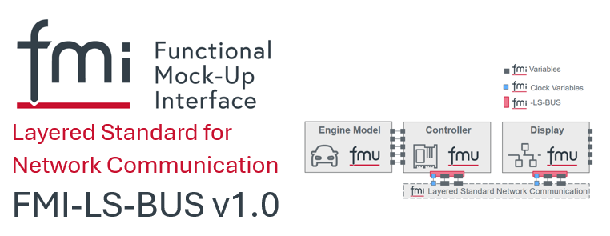
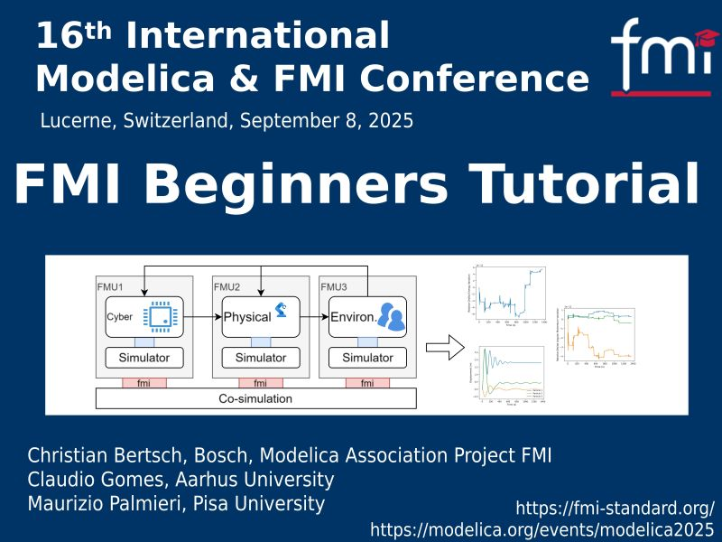

{::options parse_block_html="true" /}

## News from the FMI Project

### 250 Tools supporting the FMI Standard

The FMI project is proud to celebrate the milestone of 250 tools supporting the Functional Mock-up Interface (FMI) standard to be listed on the [FMI tools page](https://fmi-standard.org/tools/)! We want to provide some statistics:

Supported FMI versions:
- 120 tools supporting FMI1.0 - legacy 
- 226 tools supporting FMI2.0 - today still the working horse!
- 83 tools supporting FMI3.0 - becoming the "new normal"

Supported FMI kind:
- 178 tools supporting Co-Simulation (CS) import, 133 CS export
- 83 tools supporting Model-Exchange (ME) import, 49 ME export
- 5 tools supporting Scheduled Execution (SE) import, 2 SE export

Supported Platforms: 
- 235 tools supporting the Windows platform
- 158 tools supporting the Linux platform
- 43 tools supporting MacOS
- 28 tools supporting SourceCode FMUs (that can be re-compiled to other platforms)

Commercial vs. OpenSource tools
- 197 Commercial tools
- 49 OpenSource tools

User Interface
- 84 tools with graphical user interface (GUI)
- 66 tools with command line interface (CLI)
- 66 libraries/plug-in 

### The FMI Layered Standard for Network Communication v1.0 has been released - enabling the simulation of virtual ECUs with FMI 3.0!

Increasingly complex supply chains and functional diversity in the creation of virtual ECUs (vECUs) require standardization to ensure the simple and cost-efficient exchange of vECUs for users of Software-in-the-Loop (SiL) testing solutions. FMI is an established standard for creating vECUs already using the FMI versions 1.0 and 2.0, but the capabilities for these applications has been improved significantly with the release of FMI 3.0 in 2022. Additionally FMI 3.0 allows for the specification of layered standards. These are defined based on the FMI 3.0 core standard and extend its capability for specific usage domains, in the case of the new Layered Standard the network Communication of vECUs:

CAN, CAN FD, CAN XL, LIN, FlexRay and Ethernet are network technologies that have been applied successfully over many years by all automotive OEMs worldwide. Virtualizing ECUs and then simulating such vECUs requires connecting them using a virtual version of these network technologies.

The layered standard defines what input and output variables and which FMI 3.0 features are used and how to emulate a transport layer for such network traffic. At this point it should be explicitly mentioned that this layered standard not only relates to automotive buses, but can also be extended to buses from other domains in the future.

There are two base use cases enabled:

- Physical Signal Abstraction (or High-Cut) to simply transport physical signal values between virtual ECUs:
The network properties are largely idealized: Infinite bandwidth, zero-delay etc. Signals, groups of signals and their properties (e.g., units) are usually derived from existing and validated standard network topology description formats, such as DBC, LDF, Fibex and ARXML.
- Network Abstraction (or Low-Cut) to realize virtualized bus driver implementations:
This transport layer emulation allows anything from idealized to more detailed network simulations, including bandwidth restrictions, message arbitration and delays. It forwards the network payloads using binary variables. The Low-Cut abstraction layer is meant to allow virtualized bus driver implementations, including feedback from the physical drivers about transmission status or network node states. Since the Network Abstraction layer is protocol-independent, it can also be used for the simulation of non-automotive control units, e.g., from the field of industrial automation.

The FMI Layered Standard for Network Communication (FMI-LS-BUS) has been created in a collaborative effort by a working group within the FMI Project with contributions from Akkodis, AVL, Beckhoff, Bosch, dSPACE, PMSF and Synopsys (in alphabetical order). 

The FMI Steering Committee has now released the version v1.0 of the FMI 3.0 Layered Standard for Network Communication (FMI-LS-BUS). This version includes the common Physical Signal Abstraction, that fits for all bus types, and the Network Abstraction that supports CAN, CAN FD, CAN XL. Additionally a pre-release of FMI-LS-BS v1.1.0-beta was published supporting the next planned bus types Flexray and Ethernet. A chronological overview of the supported and planned bus types can be found in the [FMI-LS-BUS Roadmap](https://github.com/modelica/fmi-ls-bus?tab=readme-ov-file#roadmap).

The new Layered Standard has been heavily tested during the development, and already is supported by the following tools: 
Altair Twin Activate, dSPACE SystemDesk, dSPACE VEOS, Model.CONNECT, Synopsys Silver, Vector SIL Kit, Vector vVIRTUALtarget (for more information see  https://github.com/modelica/fmi-ls-bus)

The FMI Layered Standard for Network Communication is accompanied by other layered standards to improve the simulation of vECUs: 

- The FMI-LS-XCP (v1.0 released, see https://github.com/modelica/fmi-ls-xcp) which enables the measurements via the ASAM XCP standard
- The FMI Layered Standard for the Structuring of data (FMI-LS-STRUCT, v1.0-alpha available, see https://github.com/modelica/fmi-ls-struct) which defines support for maps.

Together they represent a significant part of the functionality required for carrying out SiL tests in vECUs by using the popular FMI 3.0 standard. 
They enable the faster exchange of vECUs and give users the option of tool freedom when creating and simulating vECUs. Ultimately, this reduces the process complexity for exchanging and makes it significantly more cost-efficient to create and simulate vECUs. 

We will present the new Layered Standard for Network communication also at the coming "16th International Modelica and FMI Conference" in Lucerne, Sept 8-10 2025, in our talk "FMI Layered Standard for Network Communication: Applications in Networked ECU Development". [Come and meet us there](https://modelica.org/events/modelica2025/)!

### 16th International Modelica _and FMI_ Conference Sept 8-10 2025 in Lucerne, Switzerland

We are happy to invite you to the coming [16th International Modelica & FMI Conference](https://modelica.org/events/modelica2025/) in Lucerne, where the importance of FMI is now also reflected in the conference title!

This is the most attractive conference also for participants mainly interested in FMI as participants can select sessions focused on FMI from the beginning to the end of the conference. Check out the [(preliminary) conference program](https://modelica.org/events/modelica2025/Tutorial_Abstracts_16th_Modelica_and_FMI_Conference.pdf)

- tutorials on FMI
  - FMI Beginners' Tutorial (see below)
  - CasADi tutorial on dynamic optimization with FMI 3.0 Model Exchange
  - Exporting and importing an FMU using C code
  - FMUGym: From Uncertainty-Aware Simulation to Learning-Based Control with FMI and Python
  - Tutorial on FMI3 co-simulation with UniFMU
- scientific sessions on FMI
- industrial user sessions on FMI
- Modelica-related sessions that also involve the usage of FMI
- sessions on FMI's "sister" standards SSP, eFMI, DCP

Looking forward to meet you in Lucerne!

### FMI Beginners' Tutorial offered at the 16th International Modelica and FMI Conference

The FMI project is happy to announce the FMI Beginners Tutorial on September 8, 2025, in Lucerne, Switzerland.
This tutorial is ideal for newcomers to the FMI standard and co-simulation. You’ll gain practical insights, explore practical examples, and connect with experts in the field:

- Christian Bertsch, Robert Bosch GmbH, Project Leader Modelica Association Project FMI
- Claudio Gomes, Aarhus University 
- Maurizio Palmieri, Pisa University
- 
Don’t miss this opportunity to strengthen your simulation skills and become part of the Modelica & FMI community!

### FMI Advisory Committee meeting after the 16th International Modelica and FMI Conference, Sept 11 2025 in Lucerne

Besides the FMI Steering Committee members and Contributing members (see [here](https://fmi-standard.org/about/)), the FMI Advisory committee consist of the following companies: AIRBUS, blue automation, Claytex, COMSOL, DNV, Fraunhofer (IIS/EAS First, SCAI), GM Motorsports, KEB Automation, LBL, NVIDIA, Knorr-Bremse Rail Vehicle Systems, MathWorks, Open Modelica Consortium, Samares Engineering, SINTEF Nordvest, University of Halle, Volkswagen, Volvo Autonomous Solutions, VTI.

There will be a face-2-face FMI Advisory Committee meeting the day after the Modelcia and FMI Conference, Sept 11 2025 in Lucerne!

If you have a topic suggestion, or want to join as a guest, please contact contact@fmi-standard.org.

### Other Resources and Discussion Forums for FMI-related Questions

* Visit the [FMI tools page](https://fmi-standard.org/tools) listing 250 tools supporting FMI!
* Join the [LinkedIn FMI community](https://www.linkedin.com/groups/7477473/) to get the latest news on FMI, FMI supporting tools and discussions within the user community.
* Ask technical questions and discuss topics on the usage of FMI on [StackOverflow tagged "FMI"](https://stackoverflow.com/questions/tagged/fmi).
* Report problems of the standard itself or suggestions for new features in form of issues or discussions on [fmi-standard.org](https://github.com/modelica/fmi-standard)
