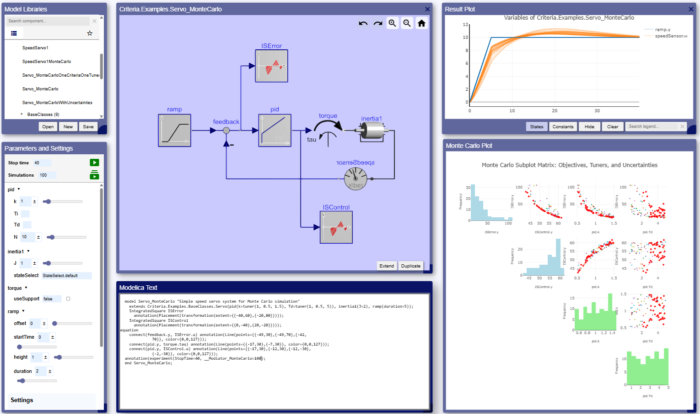

#### Modiator
Modiator (Modelica Instant Simulator) is a simulator for a subset of Modelica with some extensions. 
The compilations and simulations can run in the browser on desktops, laptops, tablets, mobiles, or using node.js 
to run on IoT devices or on the cloud. Modiator is based on pure JavaScript modules with the simulator 
based on Sundials compiled into WebAssembly. Modiator UI has a library browser, drag&drop Modelica diagram editing,
Modelica text editor, plotting, Monte Carlo simulator and analyzer, 3D animation, etc.

Modiator 0.1.0 will be released on September 8 at the [Modelica and FMI Conference, Luzern](https://modelica.org/events/modelica2025/).

#### Tutorial at the Conference
Modiator will be used during a tutorial at the conference. The participants will start to develop a Modelica 
web app simulator with a specialized user interface for a certain model/domain. The specific user 
Modelica model can be developed using the Modiator UI. A web app template will be provided which calls 
the Modiator API to compile and simulate Modelica models. The participants will adapt this template
to get a desired user interface for experimenting with their specific model. A
lternatively, AI tools can be used to produce a first Modelica model of the application and a
first version of the HTML and JavaScript code of the web app.

