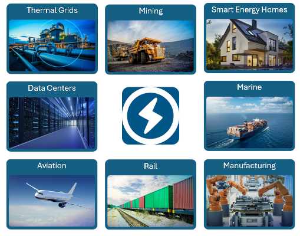

#### Sustainable Supply Systems Library released

Dassault Systèmes is happy to announce the release of the [Sustainable Supply Systems library (SuSy)](https://blog.3ds.com/brands/catia/catia-dymola-from-concept-to-prototype-in-minutes-simplifying-hybrid-energy-system-modeling-with-the-sustainable-supply-systems-library/). The SuSy library has been developed for the evaluation and optimization of complex, interconnected energy supply systems across a wide range of industrial applications, including
- Battery and renewable energy integration in smart homes, district heating, industrial production facilities
- Alternative drive train technologies and fleet simulations in railway and mining heavy equipment operations
- Marine application with on-vessel energy management and multi-domain interaction of electrical, thermal and steam energy systems
- Aircraft mission design and emission tracking
- General production process simulation with simulated flow of bulk and general materials

SuSy focuses on robust, scalable and easy-to-parameterize models. The high level modeling approach enables simulations to be performed with limited available data during early design phases. 