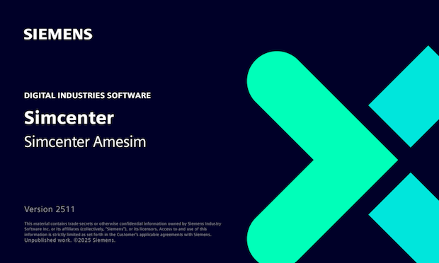
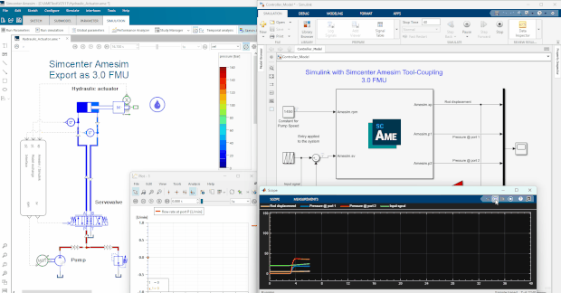

#### Simcenter Amesim 2511 released
[Siemens Digital Industries Software](https://www.sw.siemens.com/) is pleased to announce the recent release of **Simcenter&nbsp;Amesim&nbsp;2511** as part of its [system simulation solutions](https://blogs.sw.siemens.com/simcenter/simcenter-systems-release-2511/). This release introduces key updates including:

* A brand-new help browser with a more modern touch and feel.
* A new licensing and deployment model, called <b>Simcenter X Systems</b> that offers flexibility and ease of use for customers and account
managers alike.  
* An AI-enabled Chat, improving productivity across multi-language teams of <b>Simcenter X Systems</b> users.

On the modeling side, users benefit from refined model libraries and additional components, which improve accuracy and flexibility when constructing engineering systems for automotive, aerospace, and energy applications. 

#### Interactive Tool-Coupling FMUs thanks to live and fully syncrhonized Sketch Animation
Before release 2511, Sketch Animation, one of the key strengths of **Simcenter&nbsp;Amesim**'s post-processing capabilities, could only be activated when **Simcenter&nbsp;Amesim** acted as the main model / FMU importing tool. This is still particularly useful during the Software-in-th-Loop (SiL) phase in which a controller model's code can be imported to **Simcenter&nbsp;Amesim**. Now, even as of the Model-in-the-Loop (MiL) phase, this powerful capability can be used with a Tool-Coupling FMU exported from **Simcenter&nbsp;Amesim** and imported in the chosen &mdash; FMI compliant &mdash; Controls Design environment. The below example shows how to get live insight into the behavior of an exported plant model (3.0 FMU) during its coupling with **Simulink** used as external orchestrator. In this case, the Control Designer gets an improved understanding of simulation results: he/she can directly observe how the controller model interacts with the **Simcenter&nbsp;Amesim** “plant model” via animations that are perfectly synchronized with the post-processing tools of both software, for maximum flexibility and convenience throughout the running co-simulation.

For more information on **Simcenter&nbsp;Amesim**, please visit our [website](https://www.plm.automation.siemens.com/global/en/products/simcenter/simcenter-amesim.html ).

