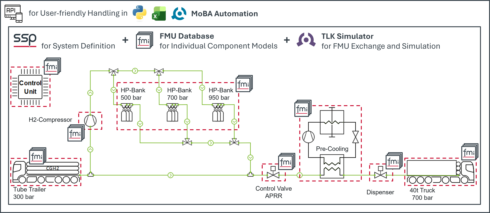

Perfect companion for Modelica enthusiasts during the Christmas season: Starting December 1st, we open a virtual door of our TLK-Thermo Advent Calendar every day. Follow us on [LinkedIn] (https://www.linkedin.com/company/tlk-thermo/) to learn tips & tricks about our Modelica related software and let yourself be inspired.

The following highlights are already waiting for you: 
- Free Download of DaVE Lite - Our powerful visualization environment to present your simulation results.
- New TIL Tutorial – On how to adapt the behavior of the TIL Suite separator model in a refrigeration cycle. Further tips on TIL will follow. Interested in specific TIL tutorials? Send us your suggestions for future topics.
- New TIL Tool – TLK’s Data Map Creator to transform your known data points into a data map as a ready-to-use Modelica model.
- System simulation for everyone via a standardized, open tool chain of SSP, FMI and TLK Simulator.

