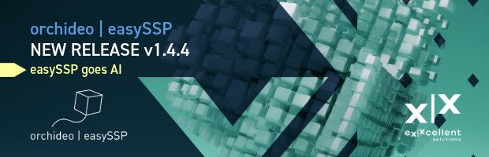

#### orchideo \| easySSP v1.4.4 released

The new **easySSP version 1.4.4** introduces major new capabilities:

With the **new Workflow Editor**, you can now create and maintain workflows directly in easySSP, making it easier to turn modeling know-how into guided, repeatable steps. You can assemble and adjust workflow content (e.g., widgets) right where you work, configure it in the integrated editor, and use helpful inline hints to understand options at a glance. A built-in Preview Mode lets you instantly validate how the workflow will look and feel during execution.

You can now **connect your preferred AI agent directly to easySSP** (powered by the AI service of your choice) and use it as a **smart co-pilot for your SSP projects** based on the open MCP protocol. Instead of clicking through menus, you can describe what you want in natural language and let the assistant create or modify system structures, including components, connectors, and connections. It can also analyze your model and answer detailed questions about the structure and intent of your SSP project. Watch the AI explain it in [this intro video](https://youtu.be/DhYMCHCsvJQ).

In addition the release includes the following **improvements and features**:

- The automatic pre-simulation check now shows detailed information for all evaluated rules.
- The input and output connector visualization has been enhanced, making the data flow easier to understand at a glance.
- Workflows now support property data binding, so you can display and edit SSP model properties directly within a workflow.
- If you include images in Markdown in your process documentation or workflows, easySSP now automatically embeds them in the appropriate context.
- When saving default simulation settings, easySSP now includes additional options (e.g., output rate).
- The Workflow documentation can now be generated in a folder of your choice.
- When creating an SSP model, you can now select the SSP version directly.
- When copying parameters within a parameter set, you can now select all parameters or ranges.
- The Radar Chart workflow widget now supports custom labels for the displayed data.

**easySSP** is based entirely on open standards like **SSP**, **FMI**, and **SSP Traceability**. Learn more at [easy-ssp.com](https://easy-ssp.com).
