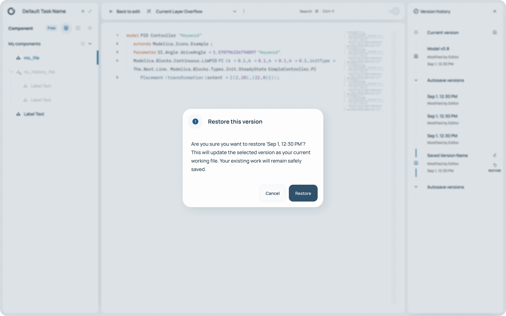
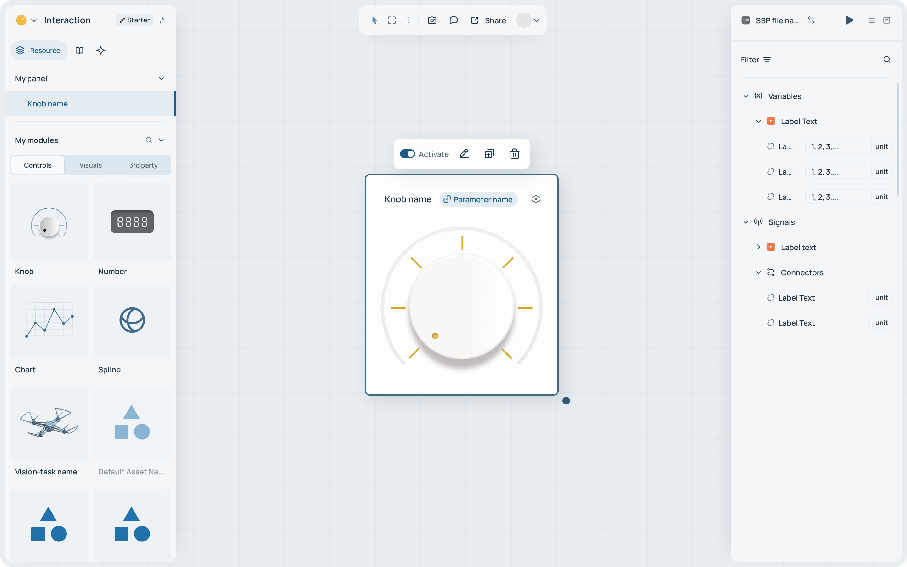

# Orthogonal Supersystems GmbH

# Orthogonal Updates ODE Suite and Launches Transfer Platform

Orthogonal Supersystems GmbH has released major updates across its **ODE** engineering suite and launched a new independent platform, **Transfer**.

1. **[ODE](https://www.orthogonal.dev/ode-plus)****&#x20;(Browser-based MBSE Suite):**

* **Component (v1.0):** This Modelica-powered cloud editor now features comprehensive **Version Control** (snapshots, history, and code comparison) and robust **Modelica Package** support (including .zip imports with resources). New capabilities also allow direct CSV/custom table imports for cloud-compatible data injection.

***

* **System (v1.0):** The System app now fully supports **SSP** (System Structure and Parameterization). A redesigned interface enables drag-and-drop FMU assembly and visual parameter management for complex architectures.
* **Architecture (Beta):** This tool bridges the gap between architectural design and behavioral simulation by synchronizing SysML models from SysOn directly into ODE Assets.

***

* **Interaction (v1.0):** A completely redesigned UX improves real-time simulation with better parameter controls, richer visualization components, and full support for FMU and SSP models.

***

* **Paper (Beta):** Now in Beta, Paper integrates computational notebooks with a restructured Python pipeline, delivering reliable execution and automatic output updates for living technical documents.

***

1. **[Transfer](https://www.orthogonal.dev/ode-transfer)****&#x20;(Model Collaboration):** A new standalone platform for sharing FMU and SSP models. Users can generate links to transform simulations into interactive, browser-based experiences without requiring viewer installation or user sign-ups.

**Website:**[www.orthogonal.dev](https://www.orthogonal.dev)

